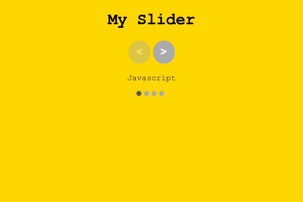

# React Very Simple Slider

This library can be used when you need a very, very, simple slider that is not limited to images.

## Recommendations

One of the reasons that motivated me to create this library, was that I didn't found slider libraries that had responsiveness to the parent component (that was what I was looking for).

Please, don't try to use versions below `0.2.0`.

## How to use

Install the library:

```bash
npm i -S react-very-simple-slider
```

Use the slider as in the example bellow:

```tsx
import React, { CSSProperties } from 'react'
import { Slider } from 'react-very-simple-slider'


function App() {
  const items = [ (<div>Javascript</div>), (<div>React.js</div>), (<div>Node.js</div>)]

  const styles = {
    app: {
      color: 'black',
      background: 'gold',
      display: 'flex',
      justifyContent: 'center',
      fontFamily: 'Courier',
      height: '100vh'
    } as CSSProperties,
    container: {
      width: '700px', 
      display: 'flex', 
      flexDirection: 'column',
      alignItems: 'center'
    } as CSSProperties
  }

  return (
    <div style={styles.app}>
      <div style={styles.container}>
        <h1>My Slider</h1>
        <Slider items={items as []} itemsPerSlide={1} />
      </div>
    </div>
  )
}

export default App
```

Result:


